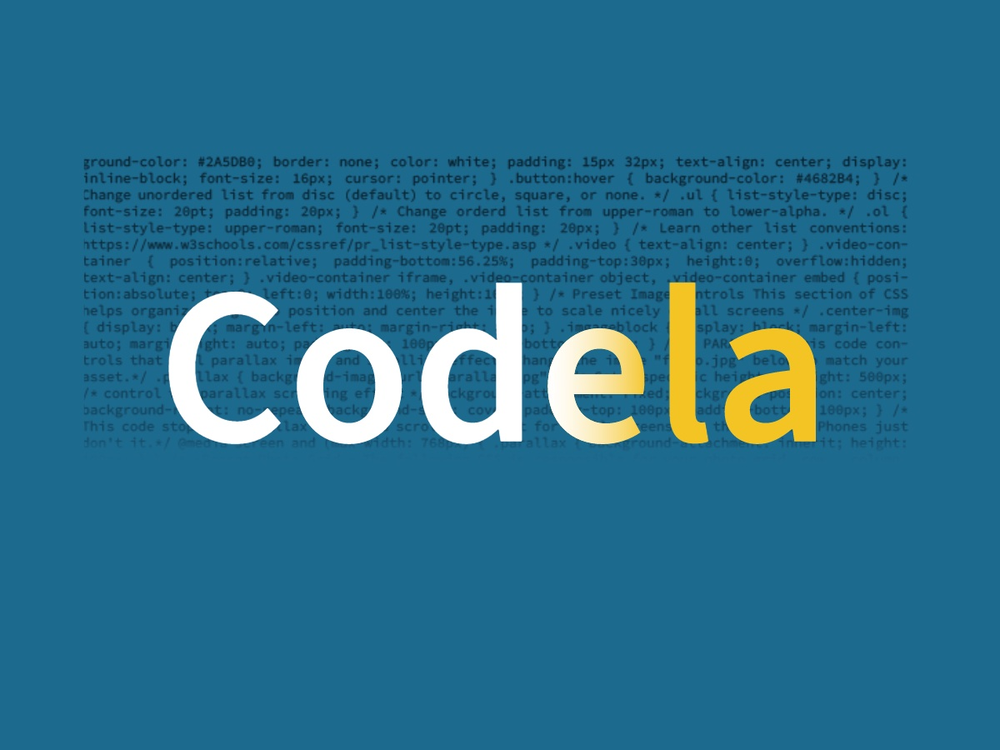
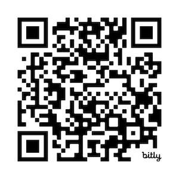

# *Codela Workshop*
***Code for the ELA classroom*** 

### https://bit.ly/47PdlSa

&nbsp;

## Workshop Goals

***Learn...***

* tools, methods, and best practices for working with code in the ELA Classroom.

* how to use a code editor.

* how to build repositories and host sites with GitHub.

* how to find resources and support to sustain *your* learning. 
&nbsp;

## Proceedings 

* [What is Open Fuego?](https://sjquigley.github.io/Open-Fuego-Presentation/) - Software design and pedagogical goals.

* [What is Codela and where do I find it?](https://codela-k12.github.io/codela-tools/) - Poject descriptions, demos, and links to GitHub repositories.

* [VisionSite](https://github.com/codela-k12/visionsite) - In this introductory project, you'll make a personal reference website.

* [Codelo Webtext Generator](https://github.com/codela-k12/webtext-generator)- Quickly build websites by copying, pasting, and arranging code. 

* [Workshop Feedback](https://docs.google.com/forms/d/e/1FAIpQLSffIR6Cml15Gz_4Enxp39Pq3ynN9ivYxCeZTf3J5Q8e9NZsWg/viewform?usp=sf_link) - I'd love to learn a little about how that went. 
&nbsp;

## Create a Codela fork for your Institution

[Open this repository](https://github.com/codela-k12/codela-tools) and follow the instruction on the ReadMe.
&nbsp;
 Forking allows others in our open-source community to follow and access your work, just as you have benefitted from this repository. ALL content may be adapted for your own institution, its purposes, and students. 

## Additional Resources

- [W3](https://www.w3schools.com) - Provides a wide range of code reference, tutorials, and a sandbox allowing code play.
- [Stack Overflow](https://stackoverflow.com) - Code questions and aggregated answers.
- [MarkDown Reference](https://daringfireball.net/projects/markdown/) - Write Markdown like a pro. 

&nbsp;

### Text Editors 

## Text Editors 

Setting up Pulsar or VS Code for Mac / Windows / Linux or CodePad for Chromebooks 

### Pulsar (Open-Source for Mac / Windows / Linux)

1. Download "**[Pulsar](https://pulsar-edit.dev)**" Pulsar comes with "Spell Check" already installed. 
1. Add HTML Preview 
	* from the dropdown menu, select **Packages>Open Package Manager**
	* select **+ Install**
	* in the search bar type "**Atom-HTML-preview**." 
	* select the package built by "**HARMSK**." Click "**Install**."
1. Adjust text wrapping 
	 -	from the dropdown menu, select **View>Toggle Soft Wrap** (this will force lines of code to conform to your view tab.)

### Visual Studio Code (Mac / Windows /Linux)

1. Download "**[Visual Studio Code](https://code.visualstudio.com/download)**"
1. Add HTML Preview 
	* from the dropdown menu, select **View>Extension.**
	* In the search bar type "**Live Preview**." Install.
	* Right click on the index.html tab and select "**show preview**." You should see a live version of your work.
1. Adjust text wrapping 
	* from the dropdown menu, select **View>Word Wrap** (this will force lines of code to conform to your viewer tab.)
1. Install Spell Check 
	* from the dropdown menu, select **View>Extension.** 
	* In the search bar type "**Code Spell Check**." Install.

### Code Pad (Chromebook)

1. Download "**[Code Pad Text Editor](https://chrome.google.com/webstore/detail/code-pad-text-editor/adaepfiocmagdimjecpifghcgfjlfmkh?hl=en-GB)**" from Chrome Web Store. 
1. From the dropdown menu, select **Editor>IDE Preferences**
1. Toggle "**Word wrap limit**" to the middle value (this will force lines of code to conform to your viewer tab.)
&nbsp;

## Best Practices for Working with Code in the Classroom

* *Yep...Work with Code* – most all of the code your students will need to write has already been written. Encourage students to work with code, not write it. (Disagree? See our final entry)

* Admit ignorance – your students will be much more responsive to learning about code and computer science when they realize that their teachers are also learners.

* Be flexible – there are many solutions to any given problem. Use difference as an opportunity to engage learning, asking questions, and assessing quality in different circumstances.

* Don’t fix things for your students – teach students to learn how to learn by directing them to the right resources.

* Promote online learning spaces – most of the questions and answers we seek have already been discussed somewhere on the internet. Encourage students to discover and contribute to these spaces on sites like GitHub and Stack Overflow, and to use other learning spaces like W3.

* Leverage classroom knowledge – acknowledging your own limitations will encourage students who may possess more knowledge than you to speak up and take leadership roles.

* Set Deadlines, but be flexible – give your students all the time they need to figure out how to work with code. Demand excellence, but ensure learning.

* Think Small Groups – small groups provide a great way to help students learn to connect with the other through code.

* Offer Debugging Sessions – students will often arrive to class with big problems that require simple solutions. Allow students time to meet in small groups to solve their coding problems.

* Utilize Small Group Presentations - presenting work in small groups takes the pressure off of presenting in larger ones. They also allow students to ask more questions and learn more about their own learning.

* Group Share - After small group presentations, require each group to share-out the highlights of their experience, not only sharing what they made, but what they learned.

* Build Confidence – Be proud of your students! Encourage them to continue working with code and learning new technologies.

* Teach to Transfer - Offer plenty of time for students to assess what they learned and to process how they learned it. Focus on aspects of rhetoric, writing, and computational thinking that will transfer into other applications.

* Promote Other Kinds of Coding Experience – It may be unrealistic to learn more than basic HTML in your classroom, but that doesn’t mean you shouldn’t encourage students to transfer their new knowledge and skills to learn more about code, even learning how to write their own.

&nbsp;

### References

Banks, A. J. (2006). Race, rhetoric, and technology: Searching for higher ground. Routledge.

Brown, J. (2015). Ethical programs: Hospitality and the rhetorics of software (p. 231). University of Michigan Press.

Byrd, Antonio. (2020). Like coming home": African Americans tinkering and playing toward a computer code bootcamp. College Composition and Communication, 71(3), 426-452.

Gee, James P. (2013). The anti-education era: creating smarter students through digital learning. New York, NY: Palgrave Macmillan.

Kern, Alfred. (1987). Basic writing: the student as programmer. ADE Bulletin, 86, 4–7.

Quigley, Stephen J.. (2022). Basic coding. Kairos: A Journal of Rhetoric, Technology, and Pedagogy 26(2). Retrieved February 15, 2023, from [https://kairos.technorhetoric.net/26.2/disputatio/quigley/index.html](https://kairos.technorhetoric.net/26.2/disputatio/quigley/index.html)

Quigley, Stephen J., Esther Lui, Samantha Whelpley and Joseph Flot. (2022) Writing Infrastructures: GitHub in the Technical and Professional Communications Classroom. Reflections; A Journal of Community Engaged Writing and Rhetoric. Retrieved February 15, 2023, from [https://reflectionsjournal.net/2022/08/editors-introduction-finding-humanity-and-community-in-pandemic-scholarship-9/](https://reflectionsjournal.net/2022/08/editors-introduction-finding-humanity-and-community-in-pandemic-scholarship-9/)

Shaughnessy, Mina. (1976). Diving in: An introduction to basic writing. College Composition and Communication, 27(3), 234-239.

Stolley, Karl. (2008). The Lo-fi manifesto. Kairos, 12(3). Retrieved November 12, 2020 from [http://kairos.technorhetoric.net/20.2/inventio/stolley/](http://kairos.technorhetoric.net/20.2/inventio/stolley/)

Vee, Annette. (2017). Coding literacy: How computer programming is changing writing. Cambridge, MA: MIT Press.

Wing, J. M. (2006). Computational thinking. Communications of the ACM, 49(3), 33-35.

&nbsp;

 

**Stephen Quigley, University of Pittsburgh, [sjq4@pitt.edu](sjq4@pitt.edu)**

